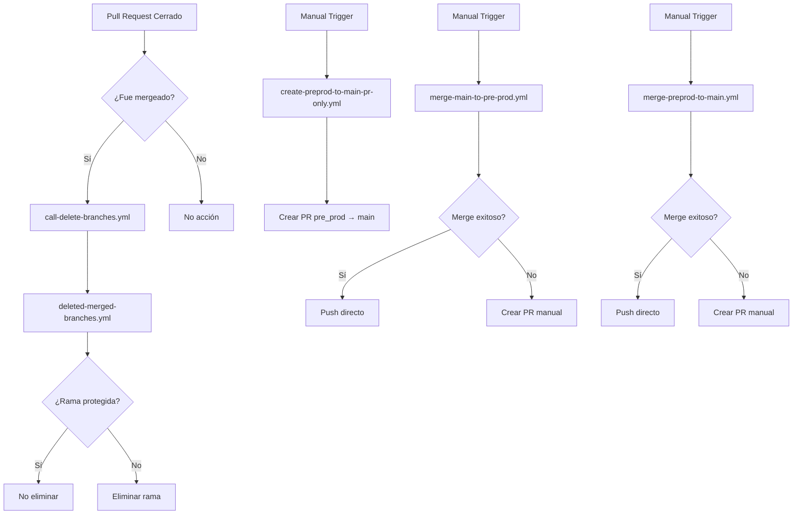

# 🚀 GitHub Actions Workflows - Equipo Digital

<div align="center">


**Sistema de Automatización y Gestión de Repositorios**

*Optimizando el flujo de trabajo del equipo digital con GitHub Actions*

</div>

---

## 📋 Tabla de Contenidos

- [🎯 Descripción General](#-descripción-general)
- [🏗️ Arquitectura del Sistema](#️-arquitectura-del-sistema)
- [⚙️ Workflows Disponibles](#️-workflows-disponibles)
- [🔧 Configuración y Uso](#-configuración-y-uso)
- [📊 Repositorios Soportados](#-repositorios-soportados)
- [🛡️ Seguridad y Permisos](#️-seguridad-y-permisos)
- [🚨 Troubleshooting](#-troubleshooting)
- [📞 Soporte](#-soporte)

---

## 🎯 Descripción General

Este repositorio contiene un conjunto de **GitHub Actions Workflows** diseñados para automatizar y optimizar el flujo de trabajo del equipo digital. Los workflows están configurados para gestionar múltiples repositorios de manera eficiente, manteniendo la integridad del código y facilitando los procesos de merge entre ramas.

### 🎯 Objetivos Principales

- ✅ **Automatización de merges** entre ramas principales
- 🗑️ **Limpieza automática** de ramas mergeadas
- 🔄 **Gestión centralizada** de múltiples repositorios
- 🛡️ **Protección de ramas** críticas
- 📋 **Templates estandarizados** para Pull Requests

---

## 🏗️ Arquitectura del Sistema



---

## ⚙️ Workflows Disponibles

### 🔄 **call-delete-branches.yml**
**Función:** Trigger automático para limpieza de ramas

- **🕐 Trigger:** Automático cuando se cierra un Pull Request
- **🎯 Propósito:** Inicia el proceso de eliminación de ramas mergeadas
- **🛡️ Protección:** Solo ejecuta si el PR fue mergeado (no solo cerrado)
- **📋 Parámetros:**
  - `protected_branches`: Lista de ramas protegidas
  - `target_branches`: Ramas que activan la eliminación

```yaml
# Ejemplo de uso
if: github.event.pull_request.merged == true
uses: futbolemotion/.github/.github/workflows/deleted-merged-branches.yml@main
```

---

### 🗑️ **deleted-merged-branches.yml**
**Función:** Eliminación inteligente de ramas mergeadas

- **🕐 Trigger:** Llamado por `call-delete-branches.yml`
- **🎯 Propósito:** Elimina ramas que ya fueron mergeadas a ramas principales
- **🛡️ Características:**
  - Verifica ramas protegidas antes de eliminar
  - Solo elimina si el target branch está en la lista permitida
  - Genera resumen detallado de la operación

**🔍 Lógica de Eliminación:**
```bash
# Ramas protegidas por defecto
main, pre_prod, Qa_test, qa, QA

# Solo elimina si:
# 1. La rama NO está protegida
# 2. El target branch SÍ está en la lista
# 3. La rama existe remotamente
```

---

### 🔄 **create-preprod-to-main-pr-only.yml**
**Función:** Creación automática de PRs de pre_prod a main

- **🕐 Trigger:** Manual (workflow_dispatch)
- **🎯 Propósito:** Crea Pull Requests para mergear cambios de `pre_prod` a `main`
- **✨ Características:**
  - Verifica diferencias entre ramas
  - Crea PRs con información detallada
  - Añade labels y assignees automáticamente
  - Solo crea PR si hay cambios pendientes

**📋 Información del PR generado:**
- Título descriptivo con número de commits
- Body detallado con checklist
- Labels: `automated-pr`, `pre-prod-to-main`, `merge`
- Assignee: Usuario que ejecutó el workflow

---

### ⚙️ **merge-main-to-pre-prod.yml**
**Función:** Merge automático de main a pre_prod

- **🕐 Trigger:** Manual (workflow_dispatch)
- **🎯 Propósito:** Mergea cambios de `main` a `pre_prod`
- **🔄 Comportamiento:**
  - Intenta merge directo si no hay conflictos
  - Crea PR automático si hay conflictos
  - Verifica existencia de ramas antes de proceder

**🎯 Casos de Uso:**
- Sincronización de cambios de producción a pre-producción
- Actualización de dependencias y configuraciones
- Propagación de hotfixes

---

### 🔑 **merge-preprod-to-main.yml**
**Función:** Merge automático de pre_prod a main

- **🕐 Trigger:** Manual (workflow_dispatch)
- **🎯 Propósito:** Mergea cambios de `pre_prod` a `main`
- **🔄 Comportamiento:**
  - Intenta merge directo si no hay conflictos
  - Crea PR automático si hay conflictos
  - Añade reviewer automáticamente

**🎯 Casos de Uso:**
- Promoción de features probadas a producción
- Release de nuevas funcionalidades
- Sincronización de cambios validados

---

## 🔧 Configuración y Uso

### 📋 Prerrequisitos

1. **🔑 Token de Acceso:**
   ```bash
   ORG_REPO_UPDATE_PAT
   ```
   - Token con permisos de escritura en repositorios de la organización

2. **🛡️ Permisos Requeridos:**
   - `contents: write`
   - `pull-requests: write`

### 🚀 Ejecución de Workflows

#### Workflows Automáticos
```bash
# Se ejecutan automáticamente al cerrar PRs
# No requiere intervención manual
```

#### Workflows Manuales
```bash
# 1. Ir a Actions en GitHub
# 2. Seleccionar el workflow deseado
# 3. Hacer clic en "Run workflow"
# 4. Seleccionar el repositorio
# 5. Ejecutar
```

---

## 📊 Repositorios Soportados

Los siguientes repositorios están configurados en todos los workflows:

| Repositorio | Descripción | Estado |
|-------------|-------------|--------|
| `zend-library` | Biblioteca principal del motor e-commerce genérico en ZF1 | ✅ Activo |
| `zend-src` | Código fuente de Zend | ✅ Activo |
| `basket-zend-src` | Código fuente vertical Basketball Emotion | ✅ Activo |
| `running-zend-src` | Código fuente de running | ✅ Activo |
| `front-land-bundle` | Bundle frontend de landing | ✅ Activo |
| `back-land-bundle` | Bundle backend de landing | ✅ Activo |
| `atland` | Repositorio Atland | ✅ Activo |
| `atland-vendor` | Vendor de Atland | ✅ Activo |
| `superadmin` | Panel de superadmin para la administración, control y despliegue de sitios web | ✅ Activo |

---

## 🛡️ Seguridad y Permisos

### 🔐 Ramas Protegidas
```yaml
protected_branches: 'main,pre_prod,Qa_test,qa,QA'
```

### 🚫 Operaciones Restringidas
- ❌ No se pueden eliminar ramas protegidas
- ❌ No se pueden hacer push directo a ramas principales
- ✅ Solo merges a través de PRs aprobados

### 🔑 Tokens y Secretos
- `ORG_REPO_UPDATE_PAT`: Token con permisos de organización
- Configuración de usuario para commits automáticos

---

## 🚨 Troubleshooting

### ❌ Problemas Comunes

#### 1. **Workflow no se ejecuta**
```bash
# Verificar:
- Permisos del token
- Configuración del trigger
- Estado del repositorio
```

#### 2. **Merge falla por conflictos**
```bash
# Solución:
- Se crea PR automáticamente
- Resolver conflictos manualmente
- Aprobar y mergear el PR
```

#### 3. **Rama no se elimina**
```bash
# Verificar:
- ¿La rama está protegida?
- ¿El target branch activa eliminación?
- ¿La rama existe remotamente?
```

### 🔍 Logs y Debugging
```bash
# Ver logs detallados en:
GitHub Actions > [Workflow] > [Job] > [Step]
```

---

## 📞 Soporte

### 👥 Equipo de Desarrollo

- **QA Engineer:** Monshy Tinoco
- **Tech Lead:** Juan Pablo López

### 📧 Contacto

- **Email:** monshy.tinoco@futbolemotion.com - juanpablo.lopez@sportsemotion.com


### 📚 Documentación Adicional

- [GitHub Actions Documentation](https://docs.github.com/en/actions)
- [Workflow Syntax](https://docs.github.com/en/actions/using-workflows/workflow-syntax-for-github-actions)
- [Security Best Practices](https://docs.github.com/en/actions/security-guides/security-hardening-for-github-actions)

---

<div align="center">

**🎉 ¡Gracias por usar nuestros GitHub Actions Workflows!**

*Desarrollado con ☕️ y 🥐 por el Equipo Digital de Sports Emotion*

[](https://github.com/futbolemotion)

</div> 